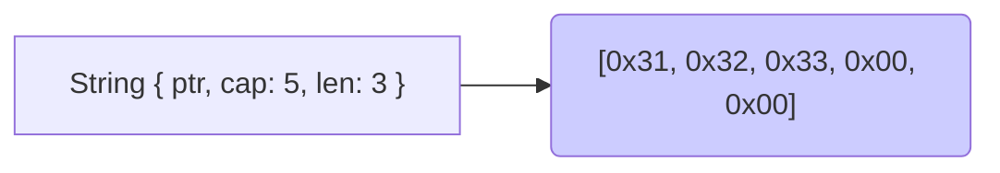
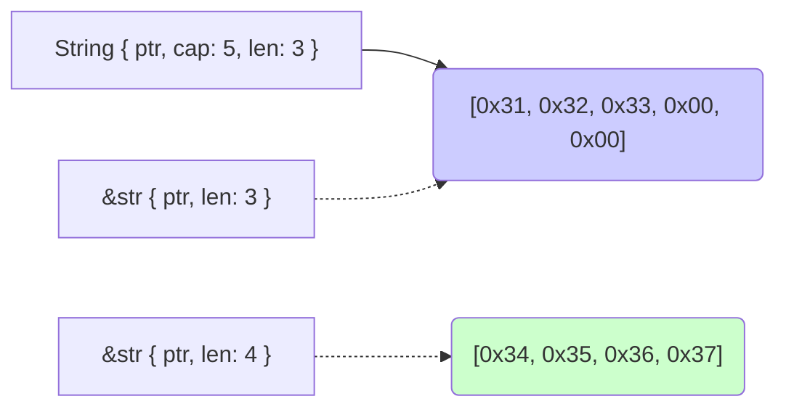

# Advanced Strings

---

There are several different kinds of strings in Rust.

Most common are `String` and `&str`.

## `String`

-   *Owns* the data it stores, and can be mutated freely
-   The bytes it points at exist on the *heap*
-   Does not implement `Copy`, but implements `Clone`



## `&str`

-   A "string slice reference" (or just "string slice")
-   Usually only seen as a borrowed value
-   The bytes it points at may be anywhere: heap, stack, or in read-only memory



Note:

The dark blue block of data is heap allocated.

The green block of data is a string literal in read-only memory (i.e. in the `.rodata` section).

## Creation

```rust []
fn main() {
    // &'static str
    let this = "Hello";
    // String
    let that: String = String::from("Hello");
    // &str
    let other = that.as_str();
}
```

## When to Use What?

-   `String` is the *easiest* to use when starting out. Refine later.
-   `String` owns its data, so works well as a field of a `struct` or `enum`.
-   `&str` is typically used in function arguments.

## `Deref` Coercion

Just because multiple types exist doesn't mean they can't work in harmony.

```rust []
fn main() {
    let part_one = String::from("Hello ");
    let part_two = String::from("there ");
    let whole = part_one + &part_two + "world!";
    println!("{}", whole);
}
```

This is because `String` s implement `Deref<Target=str>` .

## Exotic String types

-   `OsStr` and `OsString` may show up when working with file systems or system calls.

-   `CStr` and `CString` may show up when working with FFI.

The differences between `[Os|C]Str` and `[Os|C]String` are generally the same as the normal types.

## `OsString` & `OsStr`

These types represent *platform native* strings. This is necessary because Unix and Windows strings have different characteristics.

## Behind the `OsString` Scenes

-   Unix strings are often arbitrary non-zero 8-bit sequences, usually interpreted as UTF-8.
-   Windows strings are often arbitrary non-zero 16-bit sequences, usually interpreted as UTF-16.
-   Rust strings are always valid UTF-8, and may contain `NUL` bytes.

`OsString` and `OsStr` bridge this gap and allow for conversion to and from `String` and `str`.

## `CString` & `CStr`

These types represent valid C compatible strings.

They are predominantly used when doing FFI with external code.

It is strongly recommended you read *all* of the documentation on these types before using them.

## Common String Tasks

Splitting:

```rust []
fn main() {
    let words = "Cow says moo";
    let each: Vec<_> = words.split(" ").collect();
    println!("{:?}", each);
}
```

## Common String Tasks

Concatenation:

```rust []
fn main() {
    let animal = String::from("Cow");
    let sound = String::from("moo");
    let words = [&animal, " says ", &sound].concat();
    println!("{:?}", words);
}
```

## Common String Tasks

Replacing:

```rust []
fn main() {
    let words = "Cow says moo";
    let replaced = words.replace("moo", "roar");
    println!("{}", replaced);
}
```

## Accepting `String` or `str`

It's possible to accept either rather painlessly:

```rust []
fn accept_either<S>(thing: S) -> String
where S: AsRef<str> {
    String::from("foo") + thing.as_ref()
}

fn main() {
    println!("{}", accept_either("blah"));
    println!("{}", accept_either(String::from("blah")));
}
```

## Raw String Literals

-   Starts with `r` followed by zero or more `#` followed by `"`
-   Ends with `"` followed by the same number of `#`
-   Can span multiple lines, leading spaces become part of the line
-   Escape sequences are not processed

```rust []
fn main () {
    let json = r##"
{
    "name": "Rust Analyzer",
    "brandColor": "#5bbad5"
}
"##;
    assert_eq!(r"\n", "\\n");
}
```

## Byte String Literals

* not really strings
* used to declare static byte slices (have a `&[u8]` type)

```rust []
fn main() {
    let byte_string: &[u8] = b"allows ASCII and \xF0\x9F\x98\x80 only";
    println!("Can Debug fmt but not Display fmt: {:?}", byte_string);
    if let Ok(string) = std::str::from_utf8(byte_string) {
        println!("Now can Display '{}'", string);
    }
}
```
