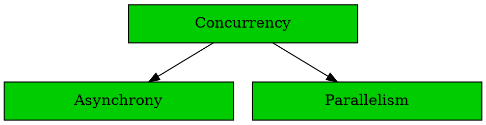

# Intro To Async/Await


## Concurrency



## Parallelism

* Running on multiple OS/hardware threads
* Pre-emptive multitasking
* Handled by OS

## Parallelism

* Running on multiple OS/hardware threads
* Pre-emptive multitasking
* Handled by OS
* Best for: *CPU-bound workloads*

## Asynchrony

* Lightweight tasks
* Interleaving tasks
* Needs user-level scheduler (executor)

## Asynchrony

* Lightweight tasks
* Interleaving tasks
* Needs user-level scheduler (executor)
* Best for: *I/O-bound workloads*

## Asynchronous Advantages

* Many thousands of tasks simultaneously
* Lower overhead per-task
* Many I/O requests in flight

## Asynchrony in Rust

Example: making an HTTP request

```rust [], ignore
async fn is_website_up(url: &str) -> Result<bool, Box<dyn Error + Send + Sync>> {
    let url = url.parse::<hyper::Uri>()?;

    let client = hyper::Client::new();
    let res = client.get(url).await?;

    let status_code = res.status();
    Ok(status_code.is_success())
}
```

## Async

* `async` marks a function as asynchronous
* Changes the return type to a Future
* Running function creates the future

## Await

* `.await` creates an await point
* Yields control back to the executor
* `.await` returns when the future has finished

## Asynchrony in Rust

```rust [], ignore
async fn fetch_into_string(url: &str) -> Result<String, Box<dyn Error + Send + Sync>> {
    let url: hyper::Uri = url.parse()?;

    let client = hyper_util::Client::new();
    let res = client.get(url).await?;

    let bytes = hyper::body::to_bytes(res.into_body()).await?;
    Ok(String::from_utf8(bytes.to_vec())?)
}
```

* Question: How many tasks are running concurrently?

## Asynchrony in Rust

* By default no asynchrony in async/await
* Needs async operators
* Most common:
  * Join: wait for all async tasks to complete
  * Select: wait for one async task to complete

## Join example

```rust [], ignore
let check_example = is_website_up("http://example.com");
let check_forever = is_website_up("http://httpforever.com");

let (example_result, forever_result) = join!(check_example, check_forever);
```

## Select example

```rust [], ignore
select! {
    example = fetch_into_string("http://example.com") =>
        println!("Example is faster with body:\n{}", example?),
    forever = fetch_into_string("http://httpforever.com") =>
        println!("HttpForever is faster with body:\n{}", forever?),
}
```

## Make Futures Go

* `Future` s are *lazy*
* executor (single-threaded or multi-threaded)

## Make Futures Go

Do lines 1 and 2 print?

```rust [9, 11], ignore
async fn call_some_api() {}

async fn do_interesting_things() {
    println!("I'm an async function and I do interesting things");
    call_some_api().await
}

fn main() {
    do_interesting_things();
    async {
        do_interesting_things().await;
    };
}
```

## Running tasks

```rust [], ignore
use futures::executor::block_on;

async fn hello_world() {
    println!("This is my task!");
}

fn main() {
    let future = hello_world(); // Nothing is printed, yet
    block_on(future);
}
```

## `block_on`

* takes a future
* blocks the current thread until the future is resolved
* async runtimes provide this method

## Runtimes

```rust [], ignore
fn main() -> Result<(), Box<dyn Error + Send + Sync>> {
    let rt = tokio::runtime::Runtime::new()?;
    rt.block_on(async {
        async_main().await
    })
}

async fn async_main() -> Result<(), Box<dyn Error + Send + Sync>> {
    // your async code
}
```

## "Async Main" Pattern

```rust [], ignore
#[tokio::main]
async fn main() -> Result<(), Box<dyn Error + Send + Sync>> {
    // your async code
}
```

## Why Many Runtimes

* `tokio` - a high-performant multithreaded runtime
* `embassy` - a tiny single-threaded runtime for microcontrollers
* ...
* task executor, scheduler, non-blocking IO APIs

## Multithreading

* `block_on` runs tasks on a single tread
* you can tell runtime that ta given async block can run on a separate thread

```rust [], ignore
#[tokio::main]
async fn main() -> Result<(), Box<dyn Error + Send + Sync>> {
    let listener = tokio::net::TcpListener::bind("127.0.0.1:6379").await?;

    loop {
        let (socket, _) = listener.accept().await?;

        tokio::spawn(async move {
            process(socket).await;
        });
    }
}

```

* other runtimes may have similar APIs

## Multithreading

Use concurrency primitives to pass or share data between async blocks:
* `Arc`, `Mutex`, channels, etc.

## `std::sync::Mutex` vs `<runtime>::Mutex`

* use `std::sync::Mutex` if critical section is short and doesn't have `await` s in it.
* use runtime's `Mutex` otherwise.

## Compatibility

* thin compatibility layer based on `std::future::Future`
* enough to support `async await` syntax only
* standardization of other APIs is in progress

## Reading an async stream

* no async iterators in the language yet
* use `while-let-await` loop:

```rust [], ignore
let mut lines = async_buffered_text_stream.lines();
while let Some(line) = lines.next().await {
    if let Ok(line) = line {
        // line is a valid utf8 `String`
        process_line(line);
    }
}
```

## Async Traits

* a big missing piece of the puzzle... has landed since Rust 1.75!
* cannot be implemented in Rust yet:

```rust []
pub trait TcpListener {
    async fn accept(&self) -> Result<(TcpStream, SocketAddr), Error>;
}
```

* can now describe common traits for async versions of `fs`, `net`, etc.
* deduplicates work for all runtimes

## Libraries

* has to either choose one runtime to work on
* or include adapters for several runtimes
* `tokio` has the largest ecosystem

## Future of Async in Rust

* async traits with dynamic dispatch
* standardize more APIs to remove the need to pick runtimes to support for libraries
* async iterators
* streams
* the progress is slow yet steady
