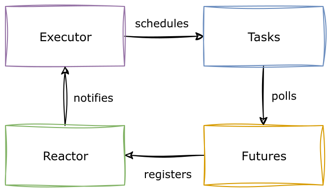

# Intro to Async Rust

## Differences between async & sync

* sync programming often has imperative behaviour
* async programming is an abstraction that allows developers to define yield points where
  the execution can be paused and later resumed

Note:

- Imperative: Statements in synchronous code are just executed step-by-step.

## Async language support

* `async` functions can define yield points where the execution can be paused, represented by
  `.await` syntax.
* Built into the language: The compiler generates the state machines required to do this
  automatically.

## Building blocks

* Built from various important building blocks
* Executors, Tasks, Futures, Reactors, and more

## An async Rust function

```rust [], ignore
use tokio::{fs::File, io::AsyncReadExt};

async fn read_from_disk(path: &str) -> std::io::Result<String> {
    let mut file = File::open(path).await?;

    let mut buffer = String::new();
    file.read_to_string(&mut buffer).await?;
    Ok(buffer)
}
```

Note:

- function must be `async` so `await` can be used inside it.
- The code between two `await`ion points has a regular synchronous flow.

## (sketch) Desugaring the return type

```rust [], ignore
use std::future::Future;

use tokio::{fs::File, io::AsyncReadExt};

fn read_from_disk<'a>(path: &'a str)
   -> impl Future<Output = std::io::Result<String>> + 'a
{
    async move {
        let mut file = File::open(path).await?;

        let mut buffer = String::new();
        file.read_to_string(&mut buffer).await?;
        Ok(buffer)
    }
}
```

Note:

- Helpful mental model: A `async` function is a regular synchronous functions that returns a `Future`.

## Executor

- Manages, schedules and executes a queue of asynchronous tasks.
- Examples of executors on host systems: `tokio` executor
- Examples of executors on embedded systems: `rtic` or `embassy-executor`

Note:

- The compiler generates Future-implementing state machines from our `async` code. The executor
  polls them
- This is inversion of control: the runtime drives our code, not the other way around.

## Futures

Represent a datastructure that - at some point in the future - give us the value that we
are waiting for. The Future may be:

* delayed
* immediate
* infinite

## Futures are operations

Futures are complete operations that can be awaited for.

Examples:

* `read`: Read (up to) a number of bytes
* `read_to_end`: Read a complete input stream
* `connect`: Connect a socket

Note:

- A future can be resolved or polled to completion, or canceled by `drop`ing them.

## Futures are poll-based

They can be checked if they are _done_, and are usually mapped to readiness based APIs.
Some examples:

- On a UNIX based OS: Using the [`epoll`](https://man7.org/linux/man-pages/man7/epoll.7.html) mechanism.
- On an Embedded ARM Cortex-M: Using architecture specific wakeup and sleep instructions.

## .await registers interest in completion

```rust [], ignore
use tokio::{fs::File, io::AsyncReadExt};

async fn read_from_disk(path: &str) -> std::io::Result<String> {
    let mut file = File::open(path).await?;

    let mut buffer = String::new();
    file.read_to_string(&mut buffer).await?;
    Ok(buffer)
}
```

Note:

- Reminder: `await` are the yield/pause points where the execution might be paused and later
  resumed

## Futures are cold

```rust [], ignore
fn main() {
    // This code will not start reading from the disk on its own.
    let read_from_disk_future = read_from_disk();
}
```

## Futures need to be executed

```rust [], ignore
use tokio::{fs::File, io::AsyncReadExt};

#[tokio::main]
async fn main() {
    let read_from_disk_future = read_from_disk();
    // We resolve the future by awaiting it. The runtime handles this for us.
    let result = read_from_disk_future.await;
    // When we get here, the read has been finished.

    println!("{:?}", result);
}

async fn read_from_disk(path: &str) -> std::io::Result<String> {
    let mut file = File::open(path).await?;

    let mut buffer = String::new();
    file.read_to_string(&mut buffer).await?;
    Ok(buffer)
}
```

## Futures all the way down: Combining Futures

```rust [], ignore
use tokio::fs::File;
use tokio::io::AsyncReadExt;
use tokio::time::Duration;

#[tokio::main]
async fn main() {
    let read_from_disk_future = read_from_disk("Cargo.toml");

    let timeout = Duration::from_millis(1000);
    let timeout_read = tokio::time::timeout(timeout, read_from_disk_future);

    let result = async {
        let task = tokio::task::spawn(timeout_read);
        task.await
    }
    .await;

    println!("{:?}", result);
}
```

## Tasks

* A task connects a future to the executor
* _The task is the concurrent unit_!
* A task is similar to a thread, but is user-space scheduled

## Reactors

* How do we avoid busy polling async tasks? Is it possible to only poll on interesting events?
* Reactors are the mechanism for this which map interest in completion to operating system
  or platform specific event mechanisms.

## Example of reactors

* In `tokio`: The low-level `mio` library provides a cross-platform API wrapping OS mechanisms
  like `epoll` / `kqueue` / `IOCP`.
* On embedded systems, interrupts are the primary reactors for event handling.

## Wakers

- Generic mechanism used by reactors or user code to notify the executor about relevant events.
- The `Context` structure passed into the `poll` method of a `Future` can be used to retrieve
  a waker.
- That waker can be stored/cached/registered for later access by other user code or by the reactor.
- At a later stage, `wake` might be called to notify the executor on relevant events.

## Tying everything together



## Categories of executors on host systems

* Single-threaded
  * Generally better latency, no synchronisation requirements
  * Highly susceptible to accidental blockades
  * Harmed by accidental pre-emption
* Multi-threaded
  * Generally better resource use, synchronisation requirements
  * Harmed by accidental pre-emption
* Deblocking
  * Actively monitor for blocked execution threads and will spin up new ones

## Ownership/Borrowing Memory in concurrent systems

* Ownership works just like expected - it flows in and out of tasks/futures
* Borrows work over `.await` points
  * This means: All owned memory in a Future _must remain at the same place_
* Sharing between tasks is often done using `Rc/Arc`

## Reference Counting

* Reference counting on single-threaded executors can be done using `Rc`
* Reference counting on multi-threaded executors can be done using `Arc`

## Streams

* Streams are async iterators
* They represent _potentially infinite arrivals_
* They cannot be executed, but operations on them are futures

## Classic Stream operations

* iteration
* merging
* filtering

## Async iteration

```rust [], ignore
while let Some(item) = stream.next().await {
    //...
}
```
