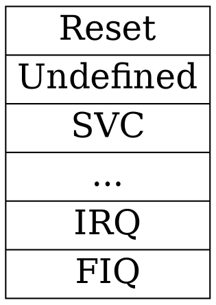

# Booting a 32-bit Arm processor

---

In this deck, we're talking specifically about classic 32-bit Arm processors.

* ARM7, ARM9, ARM11
* 32-bit Cortex-A
* 32-bit Cortex-R

Other Arm processors, and processors from other companies may vary.

## Terms

* Processor - the core that executes instructions
* SoC - the *system-on-a-chip* that contains a processor, some peripherals, and usually some memory
* Flash - the *flash memory* that the code and the constants live in
* RAM - the *random-access memory* that the global variables, heap and stack live in

## An example

* Arm Cortex-R52 - a real-time processor core from Arm
  * Use the `armv8r-none-eabihf` (or `thumbv8r-none-eabihf`) target
* NXP S32Z2 - a SoC that has 8x Cortex-R52 cores (plus six Cortex-M33s and a Cortex-M7)

## An example (2)

* Arm Cortex-A7 - an application-class processor core from Arm
  * Use the `armv7a-none-eabihf` (or `thumbv7a-none-eabihf`) target
* ST STM32MP15x - a SoC that includes two Cortex-A7 cores (and a Cortex-M4)

## Booting AArch32

The [Arm Architecture Reference Manual](https://developer.arm.com/documentation/ddi0487/latest) explains we must provide:



Each entry is a single Arm jump instruction to the relevant handler function.

Note:

Unlike on Cortex-M, there is no standardised interrupt handling mechanism beyond just "IRQ" and "Fast IRQ" (FIQ), and there is no automatic register stacking. If you want to know why you had an IRQ or FIQ, you need to talk to the interrupt controller and ask it.

## The steps

1. Write the vector table (and the handler functions) in raw assembly
2. Convince the linker to put the table at the right memory address
3. Profit

## Assembly vector table 

```c
.section .vector_table,"ax",%progbits
.arm
.global _vector_table
.type _vector_table, %function
_vector_table:
    ldr     pc, =_start
    ldr     pc, =_asm_undefined_handler
    ldr     pc, =_asm_svc_handler
    ldr     pc, =_asm_prefetch_abort_handler
    ldr     pc, =_asm_data_abort_handler
    nop
    ldr     pc, =_asm_irq_handler
    ldr     pc, =_asm_fiq_handler
.size _vector_table, . - _vector_table
```

## Rust vector table

```rust ignore
core::arch::global_asm!(r#"
    .section .vector_table,"ax",%progbits
    .arm
    .global _vector_table
    .type _vector_table, %function
    _vector_table:
        ldr     pc, =_start
        ldr     pc, =_asm_undefined_handler
        ldr     pc, =_asm_svc_handler
        ldr     pc, =_asm_prefetch_abort_handler
        ldr     pc, =_asm_data_abort_handler
        nop
        ldr     pc, =_asm_irq_handler
        ldr     pc, =_asm_fiq_handler
    .size _vector_table, . - _vector_table
"#);
```

Note:

It's exactly the same assembly code with the same directives, just in a `global_asm!` block.

## Reset Handler

* Arm systems boot with an invalid stack pointer
* C, and Rust, require a stack
* So the reset handler has to be written in assembly
* Once you have a stack, you can jump to C (or Rust) code

## Reset Handler (Rust)

* We could ship `.s` files, and use [`cc-rs`](https://crates.io/crates/cc-rs) to build them
* But `global_asm!` lets us use nice Rust constants...

## Using const with asm!

```rust ignore
core::arch::global_asm!(
    "msr     cpsr_c, {und_mode}",
    "mov     sp, r0",
    und_mode = const {
        Cpsr::new_with_raw_value(0)
            .with_mode(ProcessorMode::Und)
            .with_i(true)
            .with_f(true)
            .raw_value()
    },
);
```

Note:

Before Rust, you could either use Assembler `.macro` macros, or feed the assembly source through the C Pre-Processor and use pre-processor macros. Neither was very nice.

## The aarch32-rt crate

Does all this work for you, in a mix of inline Arm assembly and Rust

See [Reset](https://github.com/rust-embedded/aarch32/blob/0bf83561144c2f2367d992763a932fb7f6fc28a6/aarch32-rt/src/lib.rs#L866), [Linker script](https://github.com/rust-embedded/aarch32/blob/0bf83561144c2f2367d992763a932fb7f6fc28a6/aarch32-rt/link.x), and [Vector table](https://github.com/rust-embedded/aarch32/blob/0bf83561144c2f2367d992763a932fb7f6fc28a6/aarch32-rt/src/lib.rs#L525)

## The #[entry] macro

* Attaches your `fn main()` to the reset function in aarch32-rt
* Hides your `fn main()` so no-one else can call it

## Using the crate

* [rust-embedded/aarch32](https://github.com/rust-embedded/aarch32/tree/main/examples)
* [ferrous/rust-training](https://github.com/ferrous-systems/rust-training/tree/main/example-code/qemu-aarch32v8r)

## Linker scripts

* In Rust they work exactly like they do with `clang` or `gcc`
* Same `.text`, `.rodata`, `.data`, `.bss` sections
* `aarch32-rt` provides `link.x`, which pulls in a `memory.x` you supply
* You must tell the linker to use `link.x`, with:
    * A build-script
    * `rustflags` in `.cargo/config.toml`, or
    * The `RUSTFLAGS` environment variable
