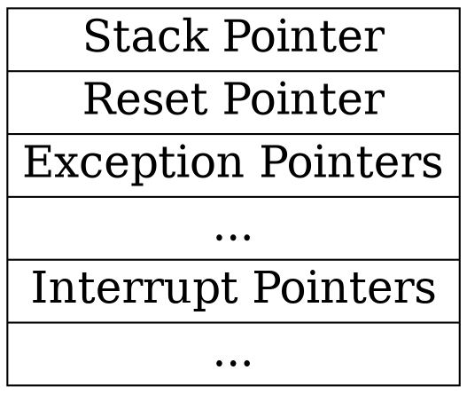

# Booting a Cortex-M Microcontroller

---

In this deck, we're talking specifically about Arm Cortex-M based microcontrollers.

Other Arm processors, and processors from other companies may vary.

## Terms

* Processor - the core that executes instructions
* SoC - the *system-on-a-chip* that contains a processor, some peripherals, and usually some memory
* Flash - the *flash memory* that the code and the constants live in
* RAM - the *random-access memory* that the global variables, heap and stack live in

## An example

* Arm Cortex-M4 - a processor core from Arm
  * Use the `thumbv7em-none-eabi` or `thumbv7em-none-eabihf` targets
* nRF52840 - a SoC from Nordic Semi that uses that processor core

## An example (2)

* Arm Cortex-M0+ - a smaller, simpler, processor core from Arm
  * Use the `thumbv6m-none-eabi` target
* RP2040 - a SoC from Raspberry Pi that uses *two* of those processor cores

## Booting a Cortex-M

The [Arm Architecture Reference Manual](https://developer.arm.com/documentation/ddi0403/ee/?lang=en) explains we must provide:



The chip does everything else.

Note:

There are fourteen defined Exception Handlers (if the chip does not support a particular Exception, you must use the special value `0x0000_0000`). The number of interrupt handlers is defined by the SoC - the Arm NVIC can handle up to 240 interrupts in Armv7-M or 480 interrupts in Armv8-M.

## The steps

1. Make an array, or struct, with those two (or more) words in it
2. Convince the linker to put it at the right memory address
3. Profit

## C vector table 

```c
__attribute__ ((section(".nvic_table"))) unsigned long myvectors[] =
{
    (unsigned long) &_stack_top,
    (unsigned long) rst_handler, 
    (unsigned long) nmi_handler, 
    // ...
}
```

## Rust vector table

```rust ignore
#[link_section=".nvic_table"]
#[no_mangle]
pub static ISR_VECTORS: [Option<Handler>; 155] = [
    Some(_stack_top),
    Some(rst_handler),
    Some(nmi_handler),
    // ...
]
```

Note:

The cortex-m-rt crate does it more nicely than this. Unlike in C, it's actually not easy at all to put both a `*mut u32` for the stack pointer, and a `unsafe extern "C" fn() -> !` for the reset function into the same array!

## C Reset Handler

Can be written in C! But it's hazardous.

```c
extern unsigned long _start_data_flash, _start_data, _end_data;
extern unsigned long _bss_start, _bss_end;

void rst_handler(void) {
    unsigned long *src = &_start_data_flash;
    unsigned long *dest = &_start_data;
    while (dest < &_end_data) {
        *dest++ = *src++;
    }
    dest = &_bss_start,
    while (dest < &_bss_end) {
        *dest++ = 0;
    }
    main();
    while(1) { }
}
```

Note:

Global variables are not initialised when this function is executed. What if the C code touches an uninitialised global variable? C programmers don't worry so much about this. Rust programmers definitely worry about this.

## Rust Reset Handler (1)

```rust ignore
extern "C" {
    static mut _start_data_flash: usize;
    static mut _start_data: usize;
    static mut _end_data: usize;
    static mut _bss_start: usize;
    static mut _bss_end: usize;
}
```

## Rust Reset Handler (2)

```rust ignore
use core::ptr::{addr_of, addr_of_mut};

#[unsafe(no_mangle)]
pub unsafe extern "C" fn rst_handler() {
    unsafe {
        let src = addr_of!(_start_data_flash);
        let dest = addr_of_mut!(_start_data);
        let size = addr_of_mut!(_end_data).offset_from(dest);
        for i in 0..size {
            dest.offset(i).write_volatile(src.offset(i).read());
        }
        let dest = addr_of_mut!(_bss_start);
        let size = addr_of_mut!(_bss_end).offset_from(dest);
        for i in 0..size {
            dest.offset(i).write_volatile(0);
        }
    }
}
```

Sadly, this is [UB](https://github.com/rust-embedded/cortex-m-rt/issues/300).

Note:

This is Undefined Behaviour because globals haven't been initialised yet and it is illegal to execute any Rust code in the presence of global variables with invalid values (e.g. a `bool` with an integer value of `2`). It's also arguably UB because you're using `write_volatile` to write outside the bounds the objects we have declared to Rust (we said that `_start_data` was *only* a single `u32`).

It is now reasonably settled that this is bad in theory, but it's debatable whether it's currently bad in practice (cortex-m-rt got away with it for years). I believe that in time it will get *worse* in practice, so don't do it.

## The cortex-m-rt crate

Does all this work for you, in raw Arm assembly language - so it's actually sound.

See [Reset](https://github.com/rust-embedded/cortex-m/blob/c-m-rt-v0.7.3/cortex-m-rt/src/lib.rs#L501), [Linker script](https://github.com/rust-embedded/cortex-m/blob/c-m-rt-v0.7.3/cortex-m-rt/link.x.in), and [Vector table](https://github.com/rust-embedded/cortex-m/blob/c-m-rt-v0.7.3/cortex-m-rt/src/lib.rs#L1130)

## The #[entry] macro

* Attaches your `fn main()` to the reset function in cmrt
* Hides your `fn main()` so no-one else can call it
* Remaps `static mut FOO: T` to `static FOO: &mut T` so they are safe

## Using the crate

See [Cortex-M Quickstart](https://github.com/rust-embedded/cortex-m-quickstart)

## Linker scripts

* In Rust, they work exactly like they do in clang or gcc.
* Same `.text`, `.rodata`, `.data`, `.bss` sections
* `cortex-m-rt` provides `link.x`, which pulls in a `memory.x` you supply.
