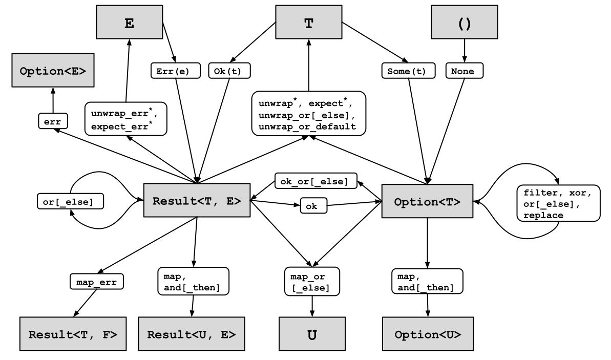

# Dealing with Unwrap

## Handling your errors

* Rust is *intentionally strict*: when failue modes happen, you have to decide how to handle them *right there*
* Recall: 
  * `Option<T>` gives you information on if your operation produced something or nothing
  * `Result<T, E>` lets you know if something succeeded or something else (`E`) happened
* We can propagate the appropriate error context by transforming one into the other and vice versa

## Unwrap -> ?

* `.unwrap()`'ing both `Option` and `Result` *seems* like an the easy way out
* Cons: refactoring later never happens and leads to more brittle code

Instead, prefer using the early return `?` operator where possible, or at least `.expect()`

## `?` Examples

Let's see how we can get to `?` as quickly as possible in cases where

* You have many eager returns
* You have `match` statements where all cases must succeed to go forward

## `?` vs Eager Returns

`?` turns this

```rust [], ignore
fn write_info(info: &Info) -> io::Result<()> {
    // Early return on error
    let mut file = match File::create("my_best_friends.txt") {
           Err(e) => return Err(e),
           Ok(f) => f,
    };
    if let Err(e) = file.write_all(format!("name: {}\n", info.name).as_bytes()) {
        return Err(e)
    }
    if let Err(e) = file.write_all(format!("age: {}\n", info.age).as_bytes()) {
        return Err(e)
    }
    if let Err(e) = file.write_all(format!("rating: {}\n", info.rating).as_bytes()) {
        return Err(e)
    }
    Ok(())
}
```

## `?` vs Eager Returns 2

Into this

```rust [], ignore
fn write_info(info: &Info) -> io::Result<()> {
    let mut file = File::create("my_best_friends.txt")?;
    // Early return on error
    file.write_all(format!("name: {}\n", info.name).as_bytes())?;
    file.write_all(format!("age: {}\n", info.age).as_bytes())?;
    file.write_all(format!("rating: {}\n", info.rating).as_bytes())?;
    Ok(())
}
```

## `?` vs Pattern Matching

As well as this

```rust []
fn add_last_numbers(stack: &mut Vec<i32>) -> Option<i32> {
    let a = stack.pop();
    let b = stack.pop();

    match (a, b) {
        (Some(x), Some(y)) => Some(x + y),
        _ => None,
    }
}
```

## `?` vs Pattern Matching 2

```rust []
fn add_last_numbers(stack: &mut Vec<i32>) -> Option<i32> {
    Some(stack.pop()? + stack.pop()?)
}
```

We prefer using `?` instead of highly nested pattern matching

## Option into Result

* Sometimes we may have the absence of a value, but we want to add more context to the handler
* In essence: we have `Option`, but we want a `Result`:

```rust [], ignore
fn find_user(username: &str) -> Option<&str> {
    let f = match std::fs::File::open("/etc/password") {

    }
    // ...
}
```

* Use the `.ok_or_else()` function to change a `Option<T>` into `Result<T, E>` lazily

## Option into Result 2

```rust [], ignore
pub fn find_user(username: &str) -> Result<UserId, Err> {
    let f = std::fs::File::open("/etc/passwd")
        .ok_or_else(|| Err(0))?;
    // ...
}
```

* As application complexity grows (and examples would no longer fit on a slide), prefer the
additional context of `Result<T, E>` over the simple `Option<T>`.
* There are stdlib functions to handle those transitions

## Result to Result

* We don't really want bare a `Err` - no information on how to proceed if you're handler
* As you propagate your error, process the context to transform it
* Basically, if we have `Result<_, A>` but want `Result<_, B>`, we can use `.map_err()`

```rust [], ignore
pub fn find_user(username: &str) -> Result<UserId, String>  {
    let f = std::fs::File::open("/etc/passwd")
        .map_err(|e| format!("Failed to open password file: {:?}", e))?;
    // ...
}
```


## Result to Result 2

* The `String`y based errors are not ideal.
* We prefer idiomatic error types:

```rust [9], ignore
pub type MyError = String;
impl std::error::Error for MyError {}
enum MyError {
    BadPassword(String),
    IncorrectID,
    // ...
}

pub fn find_user(username: &str) -> Result<UserId, MyError>  {
    let f = std::fs::File::open("/etc/passwd")
        .map_err(|e| MyError::BadPassword(format!("Failed to open password file: {:?}", e)))?;
    // ...
}
```

## To be `?` or not to be `?`

* Using `?` means "stop what you are doing, deal with the error now"
  * Undesirable for long-running processes, or if we don't care about the failure

## When to not `?`

```rust [], ignore
for stream in tcp_listener.incoming() {
    // Should I use `stream?` here? 
    // No, because my whole server would stop accepting connections
    let Ok(stream) = stream else {
        eprintln("Bad connection");
        continue;
    }
}
```

## When to not `?` 2

```rust [], ignore
if let (Ok(a), Ok(b)) = (job_a(), job_b()) {
    // run this code only when both jobs succeeded
}
```

If you only care about moving on in the happy path, try judicious pattern matching with `if let`s

## Iterators: `Result` into `Option`

* Iterators usually just care about processing or finding certain elements and throwing out the uninteresting data
* Use `.filter_map()` for this:

```rust [], ignore
let a = ["1", "two", "NaN", "four", "5"];

// I don't care about bad results, I filter them out
let mut iter = a.iter().filter_map(|s| s.parse::<i32>().ok());
// Instead of 
let mut iter = a.iter().map(|s| s.parse()).filter(|s| s.is_ok()).map(|s| s.unwrap());
```

* Concretely, this means turning `Result<T, E>` into an `Option<T>` by using the `.ok()` method

## Iterators and collecting errors

If you want to process each error separately, use `Vec<Result<T, _>>`:

```rust [], ignore
let vec_of_results: Vec<Result<i32, _>> = inputs.iter()
    .map(|s| s.parse::<i32>())
    .collect();
```

## Iterators and collecting errors 2

If you only care about all of them succeeding, wrap it with `Result<Vec<i32>, _>`

```rust [], ignore
let result_of_vec: Result<Vec<i32>, _> = inputs.iter()
    .map(|s| s.parse::<i32>())
    .collect()?;
```

## Which way to wrap?

In general, we prefer wrapping the collection with an error (`Result<Vec<T>, _>` and `Option<Vec<T>>` )
rather than the other way around

## Recap

We've gone over many transformations:

* `Option<T>` to `Result<T, E>` and vice versa
* `Result<T, E>` to `Result<T, U>`

Many more variants exist depending on if you ignore the error, replace its value, provide a default, etc.

To deal with references, use `.as_ref()`.

## Diagram



## Conclusion

Worry about

* `Result<T, E>` <=> `Option<T>` and
* `Result<T, E>` <=> `Result<T, F>`

until you need something else
