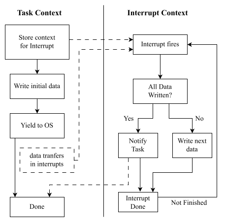

# async/await in Embedded Rust

## Non-blocking programming

- General goal: Offload work to the hardware, and use some mechanism to allow
  the CPU to do other work while the hardware does the work
- Interrupts are used to signal progress or completion of an operation

## Model of task contexts

In embedded systems, a generic model of how non-blocking programming works
often looks like this:

<figure>
  
</figure>

Note:

- Technically, yielding is optional and you can do busy-waiting to wait
  for an operation to complete. However, allowing the CPU to do other work is
  oftentimes the point of non-blocking programming in the first place.

## Mapping to Embedded Rust

- How could this be mapped to Embedded Rust?
- The general model implies an existence of a scheduler / OS. Do we want
  a non-blocking ecosystem bound to specific schedulers or operating systems?
- `async` / `await` provides a language-level solution, which can even be
  scheduling library independent.

## Async / Await

- Async / Await works by transforming you code into pollable state machines.
- From a users perspective, you can write code like this

```rust,no_run
// Some HAL specific constructor.
let my_async_uart = (...)
let my_data = &[1, 2, 3, 4];
let result = my_async_uart.write_all(my_data).await;

let async_delay = Delay;
async_delay.delay_ms(200).await;
```

- The CPU can do other work while it is waiting for the UART transfer to complete
  or the delay to elapse.

Note:

- We assume that the async UART driver was written in a non-blocking way. It would
  offload work to the hardware, and then detect the completion condition in an
  interrupt.

## `async` executors

- Embedded specific executors are usually static
- Popular executors in the Rust ecosystem: RTICv2, embassy
- Only architecture specific parts that an executor might have: Putting the system to sleep
  when there is nothing to do.

## Wakers in embedded `async`

- A waker is registered inside the hardware task is started.
- The task is put to sleep until the waker is called.
- Inside an interrupt handler, the `wake` method on the waker is called to notify the executor
  about the completion of an operation.

Note:

- Commonly used waker inside the embedded ecosystem: [`AtomicWaker`](https://docs.rs/futures/latest/futures/task/struct.AtomicWaker.html)
- Usually, a library will have static instances of that waker, tied to a library provided
  interrupt handler.

## An `async` UART driver

- We have written an `async` UART driver which can be run with QEMU. An example app using it
  can be found [here](https://github.com/ferrous-systems/rust-training/blob/main/example-code/qemu-thumbv7em/src/bin/uart_async.rs)
- The driver can be found [here](https://github.com/ferrous-systems/rust-training/blob/main/example-code/qemu-common/src/cmsdk_uart/asynch.rs)

## Under the hood of `embassy-time`

- `embassy-time` provides a very convenient API. The high-level API for users is also (seemingly)
  hardware independent. How does this work?
- We have written an embassy time driver for the simple ARM CMSDK Timer
  [here](https://github.com/embassy-rs/embassy/blob/main/embassy-time/src/driver_cmsdk/mod.rs)
- Providing `embassy-time` support boils down to mapping a timekeeper and an scheduling / alarm
  mechanism to a hardware timer inside a driver and then creating a global instance of that driver.
