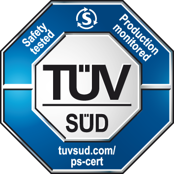

# What is Ferrocene?

## Ferrocene is

* Rust, not a subset
* A downstream of The Rust Project
* Long-term stable
* Open Source
* Qualified per ISO 26262 (ASIL D) / IEC 61508 (SIL 4)
* Supplied with a warranty
* Available with support
* Tested differently

## Rust, not a subset

* We didn't write a new Rust toolchain
* We qualified The Rust Toolchain
* The subset of Rust for safety-critical, is Rust

## A downstream of The Rust Project

* One of the Ferrocene pillars is that the standard library and the compiler must not diverge from upstream.
* We've been pulling the `master` branch of `rust-lang/rust` into our tree since 2021

## Patches

* Of course, some changes were required
* So, we upstreamed all of them
* Like [#93717], [#108659], [#111936], [#108898]...
* [#111992], [#112314], [#112418], [#112454], ...

[#93717]: https://github.com/rust-lang/rust/pull/93717
[#108659]: https://github.com/rust-lang/rust/pull/108659
[#111936]: https://github.com/rust-lang/rust/pull/111936
[#108898]: https://github.com/rust-lang/rust/pull/108898
[#111992]: https://github.com/rust-lang/rust/pull/111992
[#112314]: https://github.com/rust-lang/rust/pull/112314
[#112418]: https://github.com/rust-lang/rust/pull/112418
[#112454]: https://github.com/rust-lang/rust/pull/112454

## Virtuous Cycle

* Sometimes we find bugs that upstream missed
* So we upstreamed the fixes
* Like [#108905] or [#114613].

[#108905]: https://github.com/rust-lang/rust/pull/108905
[#114613]: https://github.com/rust-lang/rust/pull/114613

## Long-term Stable

As of 3 September 2024, the Ferrocene releases are:

* *nightly* (upstream *nightly*)
* *pre-rolling* (upstream *beta*)
* *rolling* (upstream *stable*)
* stable-24.05 (upstream *1.76*)
* stable-24.08 (upstream *1.79*)

Note:

We strive to make each stable release available for two years, including
tracking of Known Problems.

## Open Source

* Ferrocene lives at <https://github.com/ferrocene/ferrocene>
* The source code is MIT || Apache-2.0
* The docs are published at <https://public-docs.ferrocene.dev>

## Qualified per ISO 26262 (ASIL D) / IEC 61508 (SIL 4)

We're in [the TÜV SÜD database](https://www.tuvsud.com/en/services/product-certification/ps-cert?q=Z10+123030+0001+Rev.+00)

## `cargo` isn't qualified

* Qualifying a tool that touches the Internet is hard
* You don't *need* a build system...
* You can just call `rustc` (which is qualified) from a simple script for production

## `libstd` isn't certified, `libcore` will be

* It doesn't make sense to certify the Standard Library
  * It's mostly "If Windows, do X; if POSIX, do Y"
* We are looking at certifying `libcore`

## Supplied with a warranty

If you find a bug in the compiler, we will fix it or give you details on how to work around it

## Available with support

* A subscription gets you binary downloads and access to the Known Problems list
* Signed Qualification Documents are available (call us)
* If you need additional support with your Rust development, we can help

## Tested Differently

* The Rust Project only tests *Tier 1* targets
* We have developed our own CI
  * Separate and parallel to that used by The Rust Project
  * They have different goals!
* Having multiple independent, parallel, rock solid CI pipelines can only benefit Rust
* Our CI produces the artefacts we need for qualification
