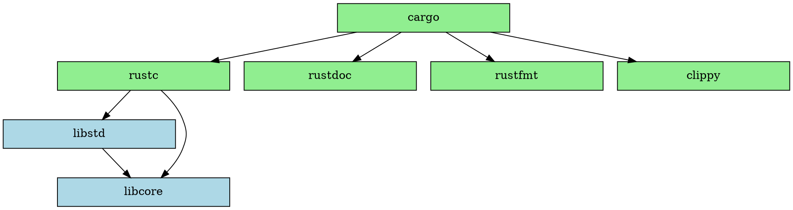

# Installation

## Rustup

Rustup installs and manages Rust compiler toolchains

<https://rust-lang.org/tools/install>

**It is not the Rust compiler!**

## Important commands

```sh
 # Installation of a toolchain (here: the stable release channel)
rustup install stable

 # Selection of a default toolchain
rustup default stable

 # Display documentation in browser
rustup doc [--std]

 # Override the default toolchain in your directory
rustup override set stable

 # List supported targets
rustup target list

 # Add and install a target to the toolchain (here: to cross-compile for an ARMv6-M target)
rustup target add thumbv6m-none-eabi
```

For up-to-date information, please see [Rust Component
History](https://rust-lang.github.io/rustup-components-history/)

## Contents of the toolchain



## Hello, world! with Cargo

```console
$ cargo new hello-world
$ cd hello-world
$ cat src/main.rs
    fn main() {
        println!("Hello, world!");
    }
$ cargo build
    Compiling hello-world v0.1.0 (file:///Users/skade/Code/rust/scratchpad/hello-world)
    Finished debug [unoptimized + debuginfo] target(s) in 0.35 secs
$ cargo run
    Finished debug [unoptimized + debuginfo] target(s) in 0.0 secs
    Running `target/debug/hello-world`
Hello, world!
```

## A Little Look Around

-   What is in Cargo.toml?
-   What is in Cargo.lock?

For details, check the [Cargo Manifest docs](http://doc.crates.io/manifest.html).

## IDEs

-   rust-analyzer: <https://rust-analyzer.github.io>
    - Implements the *Language Server Protocol*
    - Emacs, vim, Sublime, VS Code, Kate, etc...
    - Now the official VS Code extension for Rust!
    - Open Source, funded by donations
-   IntelliJ Rust plugin for their IDEs (CLion, Idea, etc.):
    <https://www.jetbrains.com/rust/>

