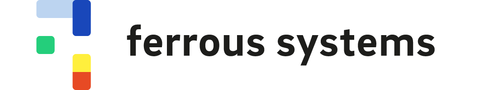
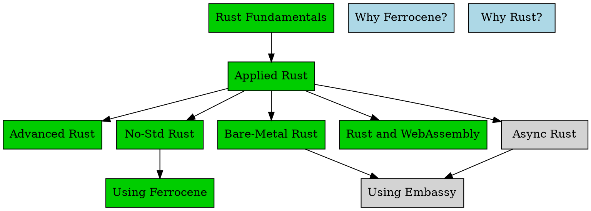

# Introduction

This book contains our training material, divided up into individual slide decks. Each deck is a *lesson*. Those *lessons* combine to form a *module*, which is taught during a series of *sessions* within a *training*. See [the glossary](./glossary.md) for more details.

This is the book version of our material. You can also see the lessons in slide form at <https://rust-training.ferrous-systems.com/latest/slides>.

We have a standard grouping of *lessons* into *modules*, but this can be customised according to customer needs. The modules have dependencies - that is, pre-requisite knowledge required to get the most out of a particular module. The dependencies are shown in the following graphic.

Most of our modules are available now (shown in blue), but some are still in development and will be available in the future (shown in grey).

## Ferrous Systems' Rust Training Modules

* **Why Rust?**: A (stand-alone) half-day tour of Rust for decision-makers, technical leads and managers.
* **Why Ferrocene?**: A (stand-alone) 60 minute introduction to Ferrocene.
* **Rust Fundamentals**: Covers the basics - types, writing functions, using iterators.
* **Applied Rust**: Using Rust with Windows, macOS or Linux.
* **Advanced Rust**: Deep-dives into specific topics.
* **No-Std Rust**: Rust without the Standard Library.
* **Bare-Metal Rust**: Rust on a microcontroller.
* **Async Rust**: Futures, Polling, Tokio, and all that jazz.
* **Rust and WebAssembly**: Using Rust to build WASM binaries, run in a sandbox or in an HTML page
* **Ferrocene**: Working with our qualified toolchain.
* **Using Embassy**: Async-Rust on a microcontroller.
