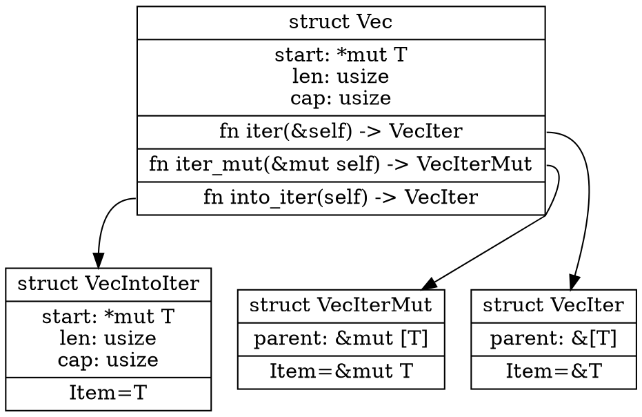

# Iterators

## What is Iterating?

> iterate (verb): to repeat a process, especially as part of a computer program ([Cambridge English Dictionary](https://dictionary.cambridge.org/dictionary/english/iterate?q=Iterate))


To *iterate* in Rust is to produce a sequence of items, one at a time.

## How do you Iterate?

* With an *Iterator*
* Commonly `.into_iter()`, `.iter_mut()` or `.iter()` on some collection
* There's also an `IntoIterator` trait for automatically creating an Iterator

## What is an Iterator?

* An object with a `.next()` method
  * The method provides `Some(data)`, or `None` once the data has run out
  * The object holds the iterator's *state*
* Some *Iterators* will take data from a collection (e.g. a Slice)
* Some *Iterators* will calculate each item on-the-fly
* Some *Iterators* will take data another iterator, and then calculate something new

Note:

Technically, all iterators calculate things on-the-fly. Some own another iterator and use that as input to their calculation, and some have an internal state that they can use for calculation. `fn next(&mut self) -> Self::Item` can only access `Self` so it is about what `Self` contains.

* `struct SomeIter<T> where T: Iterator { inner: T }`
* `struct SomeOtherIter { random_seed: u32 }`

## Important to note

* Iterators are lazy
* Iterators are used all over the Rust Standard Library
* Iterators have hidden complexity that you can mostly ignore
* Iterators cannot be invalidated (unlike, say, C++)
* Some Iterators can wrap other Iterators

## Basic usage

1. You need to make an iterator
2. You need to pump it in a loop

```rust []
fn main() {
    let data = vec![1, 2, 3, 4, 5];
    let mut iterator = data.iter();
    loop {
        if let Some(item) = iterator.next() {
            println!("Got {}", item);
        } else {
            break;
        }
    }
}
```

## Basic usage

Same thing, but with `while let`.

```rust []
fn main() {
    let data = vec![1, 2, 3, 4, 5];
    let mut iterator = data.iter();
    while let Some(item) = iterator.next() {
        println!("Got {}", item);
    }
}
```

## Basic usage

Same thing, but with `for`

```rust []
fn main() {
    let data = vec![1, 2, 3, 4, 5];
    // for <variable> in <iterator>
    for item in data.iter() {
        println!("Got {}", item);
    }
}
```

## Basic usage

Same thing, but we let `for` call `.into_iter()` for us.

```rust []
fn main() {
    let data = vec![1, 2, 3, 4, 5];
    // for <variable> in <implements IntoIterator>
    for item in &data {
        println!("Got {}", item);
    }
}
```

## Three kinds of Iterator



## Three kinds of Iterator

* Borrowed (`data.iter()`)
* Mutably Borrowed (`data.iter_mut()`)
* Owned (`data.into_iter()`)

## But how did that for-loop work?

If a `for` loop calls `.into_iter()` how did we get a borrowed iterator?

```rust []
fn main() {
    let data = vec![1, 2, 3, 4, 5];
    for item in &data {
        // item is a &i32
        println!("Got {}", item);
    }
}
```

## But how did that for-loop work?

The `&` is load-bearing...

```rust [1-9|2|3|4-5]
fn main() {
    let data = vec![1, 2, 3, 4, 5];
    let temp = &data;
    // This is .into_iter() on a `&Vec` not a `Vec`!
    let iter = temp.into_iter();
    for item in iter {
        println!("Got {}", item);
    }
}
```

Note:

* `IntoIterator` is actually dependent on the context. Depending on the context it will produce an iterator with owned elements, with references to elements, with mutable references to elements.
* e.g. `impl<T, A> IntoIterator for Vec<T, A>` for owned
* `impl<'a, T, A> IntoIterator for &'a Vec<T, A>` for refs
* `impl<'a, T, A> IntoIterator for &'a mut Vec<T, A>` for mut refs

## Things you can make iterators from

* [Ranges](https://doc.rust-lang.org/std/ops/struct.Range.html) (`0..10` or `0..=9`)
* [Slices](https://doc.rust-lang.org/std/primitive.slice.html) (`&[T]`)
* Things that deref to a slice (like [`Vec<T>`](https://doc.rust-lang.org/std/vec/struct.Vec.html))
* A [`HashMap`](https://doc.rust-lang.org/std/collections/struct.HashMap.html) or [`BTreeMap`](https://doc.rust-lang.org/std/collections/struct.BTreeMap.html)
* A [String slice](https://doc.rust-lang.org/std/primitive.str.html) (to get [chars](https://doc.rust-lang.org/std/primitive.str.html#method.chars), or [bytes](https://doc.rust-lang.org/std/primitive.str.html#method.bytes), or [lines](https://doc.rust-lang.org/std/primitive.str.html#method.lines), or [words](https://doc.rust-lang.org/std/primitive.str.html#method.split_whitespace)...)
* A [Buffered I/O Reader](https://doc.rust-lang.org/std/io/trait.BufRead.html), to get [Lines of text](https://doc.rust-lang.org/std/io/trait.BufRead.html#method.lines)
* A [TCP Listener](https://doc.rust-lang.org/std/net/struct.TcpListener.html#method.incoming), to get [TCP Streams](https://doc.rust-lang.org/std/net/struct.TcpStream.html)
* Much more!

Note:

Technically a Range *is* an Iterator. Some people consider this to be a mistake.
Especially as `Range<T> where T: Copy` is not itself `Copy`.

## How does this work?

* Rust has some `traits` which describe how iterators work.
* We'll talk more about traits later!

# You can still enjoy it without knowing how it works

## Useful Iterator methods (1)

These consume the old Iterator and return a new Iterator:

* `skip(N)`
* `take(N)`
* `cloned()`
* `map(func)`
* `filter(func_returns_bool)`
* `filter_map(func_returns_option)`
* `zip(second_iterator)`

Note:

* `skip(N)` will skip the first N items from the underlying iterator, then just pass every other item through
* `take(N)` will take the first N items from the underlying iterator, then just tell you there is nothing left
* `cloned` takes an iterator that gives you references, and calls `.clone()` on each reference to create a new object
* `map(func)` will give you a new iterator that fetches an item from the underlying iterator, calls `func` with it, and gives you the result
* `filter(func)` will give you a new iterator that fetches an item from the underlying iterator, calls `func` with it, and if it's not true, refuses to give it to you and tries the next item instead
* `filter_map(func)` is both a filter and a map - the `func` should return an `Option<T>` and anything `None` is filtered out
* `zip` will take this iterator, and the given iterator, and produce a new iterator that produces two-tuples (`(itemA, itemB)`)

## Useful Iterator methods (2)

These actively fetch every item from the old Iterator and produce a single value:

* `sum()`
* `count()`
* `collect()`
* `max()` and `min()`
* `fold(initial, func)`
* `partition(func)`

Note:

* `sum` will add up every item, assuming they are numeric
* `count` will tell you how many items the iterator produced
* `collect` will take every item from the iterator and stuff it into a new collection (e.g. a `Vec<T>`)
* `max` and `min` find the largest/smallest item
* `fold` will maintain an accumulator, and call `func` with each item and the current value of the accumulator
* `partition` will create two new collections by taking every item from the iterator and stuffing it into one of two new collections

## Call chaining (1)

This style of code is idiomatic in Rust:

```rust [1-13|1-8|3|4|5|6|7]
/// Sum the squares of the even numbers given
fn process_data(data: &[u32]) -> u32 {
    data.iter()
        .cloned()
        .filter(|n| n % 2 == 0)
        .map(|n| n * n)
        .sum()
}

fn main() {
    let data = [1, 2, 3, 4];
    println!("result = {}", process_data(&data));
}
```

Note:

* Point out the type inference where Rust figures out `data` is an array of `u32` and not the default `i32`s.

## Call chaining (2)

What really happened:

```rust [1-13|1-8|3|4|5|6|7]
/// Sum the squares of the even numbers given
fn process_data(data: &[u32]) -> u32 {
    let ref_iter = data.iter();
    let value_iter = ref_iter.cloned();
    let evens_iter = value_iter.filter(|n| n % 2 == 0);
    let squares_iter = evens_iter.map(|n| n * n);
    squares_iter.sum()
}

fn main() {
    let data = [1, 2, 3, 4];
    println!("result = {}", process_data(&data));
}
```

Note:

For the more advanced students, this mini quiz is a good one:
https://dtolnay.github.io/rust-quiz/26
