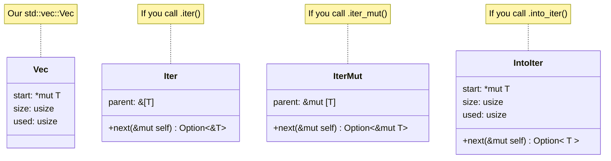

# Iterators

## What is an Iterator?

* A method of visiting every item in a collection
* An object with a `.next()` method
  * The method provides `Some(data)`, or `None` once the data has run out

## Important to note

* Iterators are lazy
* Iterators are used all over the Rust Standard Library
* Iterators have hidden complexity that you can mostly ignore
* Iterators cannot be invalidated (unlike, say, C++)
* Some Iterators can wrap other Iterators

## Basic usage

1. You need to make an iterator
2. You need to pump it in a loop

```rust []
fn main() {
    let data = [1, 2, 3, 4, 5];
    let mut iterator = data.iter();
    loop {
        if let Some(item) = iterator.next() {
            println!("Got {}", item);
        } else {
            break;
        }
    }
}
```

## Basic usage

Same thing, but with `while let`.

```rust []
fn main() {
    let data = [1, 2, 3, 4, 5];
    let mut iterator = data.iter();
    while let Some(item) = iterator.next() {
        println!("Got {}", item);
    }
}
```

## Basic usage

Same thing, but with `for`

```rust []
fn main() {
    let data = [1, 2, 3, 4, 5];
    // for <variable> in <iterator>
    for item in data.iter() {
        println!("Got {}", item);
    }
}
```

## Basic usage

Same thing, but we let `for` call `.into_iter()` for us.

```rust []
fn main() {
    let data = [1, 2, 3, 4, 5];
    // for <variable> in <implements IntoIterator>
    for item in &data {
        println!("Got {}", item);
    }
}
```

## Three kinds of Iterator



## Three kinds of Iterator

* Borrowed (`data.iter()`)
* Mutably Borrowed (`data.iter_mut()`)
* Owned (`data.into_iter()`)

## But how did that for-loop work?

If a `for` loop calls `.into_iter()` how did we get a borrowed iterator?

```rust []
fn main() {
    let data = [1, 2, 3, 4, 5];
    for item in &data {
        // item is a &i32
        println!("Got {}", item);
    }
}
```

## But how did that for-loop work?

The `&` is load-bearing...

```rust [1-8|2|3|4-5]
fn main() {
    let data = [1, 2, 3, 4, 5];
    let temp = &data;
    // This is .into_iter() on a `&Vec` not a `Vec`!
    let iter = temp.into_iter();
    for item in iter {
        println!("Got {}", item);
    }
}
```

## Things you can make iterators from

* Ranges (`0..10` or `0..=9`)
* `&[T]` (i.e. slices)
* Things that deref to a slice (like `Vec<T>`)
* HashMaps and BTreeMaps
* Strings (over chars, or bytes, or lines, or words...)
* Lines of text in a file
* TCP Sockets on a Listener
* Much more!

## How does this work?

* Rust has some `traits` which describe how iterators work.
* We'll talk more about traits later!

## You can still enjoy it without knowing how it works

[Iterators](https://docs.rust-lang.org/std/) have a bunch of very useful methods.

Each consumes the old Iterator and returns a new Iterator (or just a value).

* `sum()`
* `count()`
* `map(func)`
* `filter(func_returns_bool)`
* `filter_map(func_returns_option)`
  
## Call chaining

This style of code is idiomatic in Rust:

```rust
/// Sum the squares of the even numbers given
fn process_data(data: &[u32]) -> u32 {
    data.iter()
        .cloned()
        .filter(|n| n % 2 == 0)
        .map(|n| n * n)
        .sum()
}

fn main() {
    let data = [1, 2, 3, 4];
    println!("result = {}", process_data(&data));
}
```
