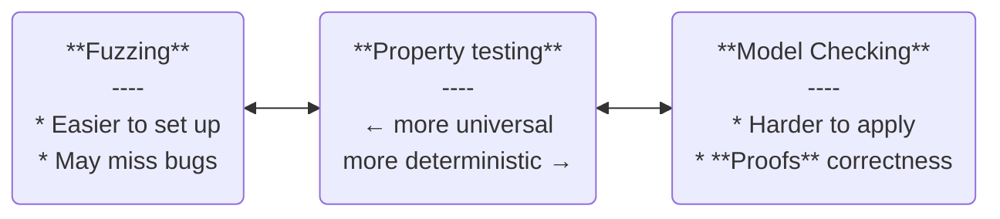

<!-- markdownlint-disable MD048 -->
# Building Robust Programs with Kani

## Rust Guarantees are Very Strong

* No `null`-dereferencing
* No uninitialized memory access
* No use-after-free
* No double-free
* No data races

## Some bits can still be tricky

* Numbers, both integer and floating point
* Some operations can `panic!`
* FFI, *unsafe* code

## IEE754 Floating point numbers

* `NaN`
  * propagates through operations `x + NaN => NaN`
  * breaks equality symmetry (`NaN != NaN`)
* Cancellation
  * subtraction of nearly equal operands may cause extreme loss of accuracy
    * 28 US Army soldiers were killed in 1991 because of this
* Division Safety test is difficult
* Limited exponent range leads to overflows and underflows

Note: [On 25 February 1991, a loss of significance in a MIM-104 Patriot missile battery prevented it from intercepting an incoming Scud missile in Dhahran, Saudi Arabia, contributing to the death of 28 soldiers from the U.S. Army](https://www.gao.gov/products/imtec-92-26)

## Integers in Rust

* `a + b` can overflow
  * triggers a `panic` at runtime in debug mode
  * wraps around in release mode
  * this is customizable!
* `a.checked_add(b)` produces an `Option`
* `a.overflowing_add(b)` produces a `(value, overflow_flag)`
* `a.saturating_add(b)` clamps the value within the `MIN..=MAX` range
* `a.wrapping_add(b)` allows wraparounds without `panic`
* most people would still prefer writing code using operators

## Panics

* Does my program `panic` is **hard** question in Rust
* `#[no_std]`-only? [`panic-never`](https://docs.rs/panic-never/latest/panic_never/)
  * triggers a linker error if there's panicking code path in the binary
  * limited use: Standard Library and 3rd part crates have panicking code
* `Clippy` has lints against well-known panicking APIs in standard library
* No easy way to list all panicking call-sites across *all* dependencies

## Unsafe Rust

* `ptr.as_ref()` produces `Option<&T>`
  * can prevent `null`-dereferencing
  * cannot guarantee that the pointer is well-aligned / points to correct type
* lifetime information can be lost

## Verifying program's behavior

* Static analysis tools: Clippy
* **Testing**

## Generative testing

"Let's come up with many potential program inputs

and observe program behavior"

## Fuzzing

* Produce essentially random inputs
  * Often context-aware.
* Time budget
  * "run the test X times" (X is often in 10_000s)
* Outcomes are non-deterministic

## Property-based testing

* Generate the complete set of potential input combinations.
  * Test time often grows non-linearly
  * Time limit can prevent it from finding bugs
* Still selects values at random to try to observe different behaviors earlier.
* When observes different behavior explores the related input combinations to produce the minimal test case.

## Model Checking

* Aware of your code structure
  * Including hidden code-paths like panics
* Builds a model of all your program states
  * Uses SAT / SMT solver to **proof** the validity of program behavior
  * Building a model of your code may take a long time

## Generative testing is a spectrum



<!--

 -->
## Installing Kani

```bash
cargo install --locked kani-verifier
cargo kani setup
```

Note: Natively runs on x86-64 Linux, and Intel and Apple Silicon macOS
Windows users can run the example in a dev container.

## How to use Kani 1

```bash
cargo new --lib hello-kani
cd hello-kani
cargo add --dev kani-verifier
```

## How to use Kani 2

```rust ignore
#[cfg(kani)]
mod proofs {
    use super::*;

    #[kani::proof]
    fn verify_add() {
        let a: u64 = kani::any();
        let b: u64 = kani::any();
        let result = add(a, b);

        // Assert that the result does not overflow
        assert!(result >= a);
        assert!(result >= b);
    }
}
```

Note: while the word "proof" is used in code Kani calls its tests "harnesses" because technically the function `verify_add` acts as a test harness that runs generated tests.

## How to use Kani 3

```bash
cargo kani
```

```text
...
SUMMARY:
 ** 1 of 3 failed
Failed Checks: attempt to add with overflow
 File: "src/lib.rs", line 2, in add

VERIFICATION:- FAILED
...
```

## How to use Kani 4

```bash
cargo kani -Z concrete-playback --concrete-playback=print
```

~~~text
Concrete playback unit test for `proofs::verify_add`:
```
/// Test generated for harness `proofs::verify_add`
///
/// Check for `assertion`: "attempt to add with overflow"

#[test]
fn kani_concrete_playback_verify_add_7155943916565760311() {
    let concrete_vals: Vec<Vec<u8>> = vec![
        // 13835058055282163713ul
        vec![1, 0, 0, 0, 0, 0, 0, 192],
        // 9223372036854775804ul
        vec![252, 255, 255, 255, 255, 255, 255, 127],
    ];
    kani::concrete_playback_run(concrete_vals, verify_add);
}
```
~~~

## How to use Kani 5

```rust
#[cfg(kani)]
mod proofs {
    use super::*;

    #[test]
    fn kani_concrete_playback_verify_add_7155943916565760311() {
        //
    }
}
```

```bash
&#35; run playback tests
cargo kani playback -Z concrete-playback
```

## Rough edges

* `kani` crate
  * not published on `crates.io`
  * the crate is *injected* in your binary when you run `cargo kani`
  * some of kani dependencies rely on *nightly-only* code
    * confuse Rust Analyzer / IntelliJ code assists
* out-of-the-box Developer Experience is very painful
  * but can be fixed in VSCode!

## Let's fix it! VSCode

* Rust Analyzer
* [Kani extension](https://marketplace.visualstudio.com/items?itemName=model-checking.kani-vscode-extension)
* CodeLLDB for debugging
* You can use Docker and DevContainers on unsupported platforms

## Let's fix it! `Cargo.toml`

```toml
[dev-dependencies]
kani-verifier = "0.56.0"

[dependencies]
&#35; enables autocomplete and code inspections for `kani::*` api
kani = { version = "0.56", git = "https://github.com/model-checking/kani", tag = "kani-0.56.0", optional = true }

&#35; removes warnings about unknown `cfg` attributes
[lints.rust]
unexpected_cfgs = { level = "warn", check-cfg = ['cfg(rust_analyzer)', 'cfg(kani)'] }
```

## Let's fix it! `.vscode/settings.json`

```json
{
    // tell Rust Analyzer that Kani features are active
    "rust-analyzer.cargo.features": ["kani"]
}
```

## Let's fix it! `*.rs`

Kani proc macros appear broken to Rust Analyzer

```rust ignore
#[cfg_attr(not(rust_analyzer), cfg(kani))]
mod proofs {
    use super::*;

    #[cfg_attr(not(rust_analyzer), kani::proof)]
    fn verify_add() {
    }

    #[test]
    fn kani_concrete_playback_verify_add_7155943916565760311() {
    }
}
```

## Full "hello world" example in our repository

https://github.com/ferrous-systems/rust-training/tree/main/example-code/kani-hello-world

## Other Kani features

* Functional contracts
* VSCode extension to run (and debug!) playbacks
* Ability to fine-tune tests:
  * `#[kani::unwind(<number>)]`
  * `#[kani::stub(<original>, <replacement>)]`
  * `#[kani::solver(<solver>)]`
  * `kani::any_where(<predicate>)`

## Feature Highlight: Function contracts

1. Define a contract for a function
2. Verify the function behavior
3. Optional: Let Kani stub out the function<br>when checking larger body of code

## Function contracts

```rust ignore
// tell Kani what kind of values to generate
#[cfg_attr(kani, kani::requires(min != 0 && max != 0))]
// tell Kani about the expectations
#[cfg_attr(kani, kani::ensures(|&result: &u8| {
        result != 0
        && max % result == 0
        && min % result == 0
    };
))]
// only needed if the function is recursive
#[cfg_attr(kani, kani::recursion)]
pub fn gcd(max: u8, min: u8) -> u8 {
```

## Verifying contracts

```rust ignore
#[kani::proof_for_contract(gcd)]
fn check_gcd() {
    let max: u8 = kani::any();
    let min: u8 = kani::any();
    gcd(max, min);
}
```

## Using of verified contracts in other proofs

```rust ignore
#[kani::proof]
#[kani::stub_verified(gcd)]
fn check_reduce_fraction() {
    let numerator: u8 = kani::any();
    let denominator: u8 = kani::any();
    // uses `gcd`
    reduce_fraction(numerator, denominator);
}
```

## Limitations

* No multithreading support
  * No support for atomic operations
  * No support for async runtimes (but syntax is supported)
* No inline assembly
* No use of `panic!`, `catch_unwind`, and `resume_unwind` for flow control
* Loops and deep recursion balloon the number of states that require inspection
* ...

## What code to test

* Numerical code
* Parsers, serialization and deserialization code
* Decision trees, complex conditional logic
* `unsafe`
