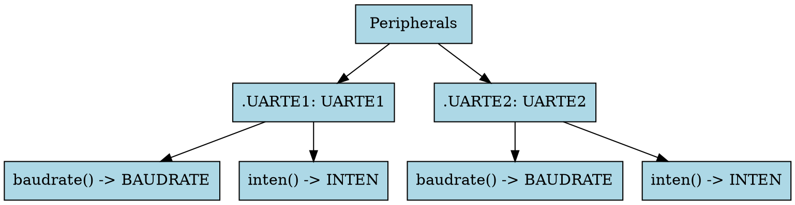

# PACs and svd2rust

## Introduction

The *Peripheral Access Crate* crate sits near the bottom of the 'stack'. It
provides access to the memory-mapped peripherals in your MCU.

## Memory Mapped Peripherals

* e.g. a UART peripheral
* Has registers, represented by a memory address
* Registers are usually consecutive in memory (not always)
* Peripherals can have instances (same layout of registers, different start address)
  * UART0, UART1, etc

Note:

The *Universal Asynchronous Receiver Transmitter* is an IP block implementing a
logic-level RS-232 interface, and one is fitted to basically every
microcontroller. Also known as a *serial port*.

Nordic calls their peripheral *UARTE*, with the E standing for *Easy DMA*.

## Registers

* *Registers* are comprised of one or more *bitfields*.
* Each bitfield is at least 1 bit in length.
* Sometimes bitfields can only take from a limited set of values
* This is all in your datasheet!

## C Code

Embedded Code in C often uses shifts and bitwise-AND to extract bitfields from
registers.

```c []
#define UARTE_INTEN_CTS_SHIFT (0)
#define UARTE_INTEN_CTS_MASK (0x00000001)
#define UARTE_INTEN_RXRDY_SHIFT (2)
#define UARTE_INTEN_RXRDY_MASK (0x00000001)

// The other nine fields are skipped for brevity
uint32_t cts = 0;
uint32_t rxrdy = 1;

uint32_t inten_value = ((cts & UARTE_INTEN_CTS_MASK) << UARTE_INTEN_CTS_SHIFT)
    | ((rxrdy & UARTE_INTEN_RXRDY_MASK) << UARTE_INTEN_RXRDY_SHIFT);

*((volatile uint32_t*) 0x40002300) = inten_value;
```

## Rust Code

You *could* do this in Rust if you wanted...

```rust ignore
const UARTE0_INTEN: *mut u32 = 0x4000_2300 as *mut u32;
unsafe { UARTE0_INTEN.write_volatile(0x0000_0003); }
```

But this still seems very error-prone. Nothing stops you putting the wrong value
at the wrong address.

## Structures in C

In C, the various registers for a peripheral can also be grouped into a `struct`:

```c []
typedef volatile struct uart0_reg_t {
    uint32_t tasks_startrx; // @ 0x000
    uint32_t tasks_stoprx; // @ 0x004
    // ...
    uint32_t inten; // @ 0x300
    uint32_t _padding[79]; 
    uint32_t baudrate; // @ 0x500
} uart0_reg_t

uart0_reg_t* const p_uart = (uart0_reg_t*) 0x40002000;
```

## Structures in Rust

```rust ignore []
#[repr(C)]
pub struct Uart0 {
    pub tasks_startrx: VolatileCell<u32>, // @ 0x000
    pub tasks_stoprx: VolatileCell<u32>, // @ 0x004
    // ...
    pub inten: VolatileCell<u32>, // @ 0x300
    _reserved12: [u32; 79],
    pub baudrate: VolatileCell<u32>, // @ 0x500
}

let p_uart: &Uart0 = unsafe { &*(0x40002000 as *const Uart0) };    
```

<p>&nbsp;<!-- spacer for "run" button --></p>

The
[`vcell::VolatileCell`](https://docs.rs/vcell/0.1.3/vcell/struct.VolatileCell.html)
type ensures the compiler emits volatile pointer read/writes. But, the reference is unsound.

Note:

svd2rust (later) generates structures that look like this.

## Access via functions

```rust
pub struct Uart { base: *mut u32 } // now has no fields

impl Uart {
    fn write_tasks_stoprx(&mut self, value: u32) {
        unsafe {
            let ptr = self.base.offset(1);
            ptr.write_volatile(value)
        }
    }

    fn read_baudrate(&self) -> u32 {
        unsafe {
            let ptr = self.base.offset(0x140);
            ptr.read_volatile()
        }
    }
}

let uart = Uart { base: unsafe { 0x40002000 as *mut u32 } };
```

Note:

The pointer is a `*mut u32` so the offsets are all in 32-bit words, not bytes.

## Access via functions (with ZSTs)

```rust
pub struct Uart<const ADDR: usize> {}

impl<const ADDR: usize> Uart<ADDR> {
    fn write_tasks_stoprx(&mut self, value: u32) {
        unsafe {
            let ptr = (ADDR as *mut u32).offset(1);
            ptr.write_volatile(value)
        }
    }

    fn read_baudrate(&self) -> u32 {
        unsafe {
            let ptr = (ADDR as *mut u32).offset(0x140);
            ptr.read_volatile()
        }
    }
}


let uart: Uart::<0x40002000> = Uart {};
```

Note:

By itself this seems a small change, but imagine a struct which represents 75
individual peripherals. That's not impossible for a modern microcontroller.
Holding one word for each now takes up valuable RAM!

## Code Generation

Can we just generate all this code, automatically?

## CMSIS-SVD Files

A CMSIS-SVD (or just SVD) file is an XML description of all the peripherals,
registers and fields on an MCU.

We can use `svd2rust` to turn this into a Peripheral Access Crate.

<br>


Note:

Although it is an Arm standard, there are examples of RISC-V based
microcontrollers which use the same format SVD files and hence can use svd2rust.

Also be aware that manufacturers often assume you will only use the SVD file to
inspect the microcontrollers state whilst debugging, and so accuracy has been
known to vary somewhat. Rust groups often have to maintain a set of patches to
fix known bugs in the SVD files.

## The `svd2rust` generated API



---

* The crate has a top-level `struct Peripherals` with members for each *Peripheral*
* Each *Peripheral* gets a `struct`, like `UARTE0`, `SPI1`, etc.
* Each *Peripheral* `struct` has methods for each *Register*
* Each *Register* gets a `struct`, like `BAUDRATE`, `INTEN`, etc.
* Each *Register* `struct` has `read()`, `write()` and `modify()` methods
* Each *Register* also has a Read Type (`R`) and a Write Type (`W`)
  * Those Read/Write Types give you access to the *Bitfields*

Note:

Earlier versions of svd2rust gave you an API where you'd access the registers
using `struct.field` syntax, which forced the use of unsound peripheral
references. Now they use a function-based API, but they still have the unsound
peripheral references under the hood.

## The `svd2rust` generated API (2)

* The `read()` method returns a special proxy object, with methods for each *Field*
* The `write()` method takes a closure, which is given a special 'proxy' object, with methods for each *Field*
  * All the *Field* changes are batched together and written in one go
  * Any un-written *Fields* are set to a default value
* The `modify()` method gives you both
  * Any un-written *Fields* are left alone

## Using a PAC

```rust ignore []
let p = nrf52840_pac::Peripherals::take().unwrap();
// Reading the 'baudrate' bitfield from the 'baudrate' register
let baudrate = p.UARTE1.baudrate().read().baudrate();
// Modifying multiple fields in one go
p.UARTE1.inten().modify(|_r, w| {
    w.cts().enabled();
    w.ncts().enabled();
    w.rxrdy().enabled();
    w    
});
```

## Wait, what's a closure?

* It's an anonymous function, declared in-line with your other code
* It can 'capture' local variables (although we don't use that feature here)
* It enables a very powerful Rust idiom, that you can't easily do in C...

## Let's take it in turns

* I, the callee, need to set some stuff up
* You, the caller, need to do a bit of work
* I, the callee, need to clean everything up

We can use a closure to insert the caller-provided code in the middle of our
function. We see this used [all
(1)](https://doc.rust-lang.org/core/iter/trait.Iterator.html#method.map) [over
(2)](https://doc.rust-lang.org/core/primitive.str.html#method.matches) [the
(3)](https://doc.rust-lang.org/std/thread/fn.spawn.html) Rust standard library!

## Quiz time

What are the three steps here?

```rust ignore []
p.UARTE1.inten().modify(|_r, w| {
    w.cts().enabled();
    w.ncts().enabled();
    w.rxrdy().enabled();
    w    
});
```

Note:

1. Read the peripheral MMIO register contents as an integer
2. Call the closure to modify the integer
3. Write the integer back to the peripheral MMIO register

## Documentation

Docs can be generated from the source code.

See <https://docs.rs/nrf52840-pac>

Note that `uarte0` is a *module* and `UARTE0` could mean either a `struct` type,
or a field on the `Peripherals` struct.

## UPPER_CASE and TitleCase

* Is it weird that it produces `UPPER_CASE` fields and types?
* There's now [a config file for that](https://github.com/rust-embedded/svd2rust/pull/794)

## Alternatives

* [`chiptool`](https://crates.io/crates/chiptool) - forked from svd2rust, but without the singletons
* [`derive-mmio`](https://docs.rs/derive-mmio) - one struct at a time, with derive-macros
* [`safe-mmio`](https://docs.rs/safe-mmio) - one struct at a time, with projection macros!

Note:

Chiptool is used by the embassy project.

---

The [`derive-mmio`](https://docs.rs/derive-mmio) crate is from Knurling.

```rust,ignore
#[derive(derive_mmio::Mmio)]
#[repr(C)]
struct Registers {
    #[mmio(Read, Write)]
    data: u32,
    #[mmio(ReadPure)]
    state: State,
    #[mmio(ReadPure, Write)]
    control: Control,
}

let mut uart_registers = unsafe { Registers::new_mmio_at(0x900_0000) };
uart_registers.write_data(b'x' as u32);
```

See [an example](https://github.com/ferrous-systems/rust-training/tree/main/example-code/qemu-common/src/cmsdk_uart/basic.rs).

Note:

The `data` register is marked `(Read, Write)` because the default is `(PureRead,
Write)` and reading from the `data` register has side-effects (it reads from a
hardware FIFO). Fields that are `PureRead` can be read through `&self`
references (writes and non-pure reads require `&mut self`).

---

The [`safe-mmio`](https://docs.rs/safe-mmio) crate is from Google.

```rust,ignore
#[repr(C)]
use safe_mmio::{ReadWrite, ReadPureWrite, ReadPure, UniqueMmioPointer, field};

struct UartRegisters {
    data: ReadWrite<u8>,
    status: ReadPure<u8>,
    control: ReadPureWrite<u8>,
}

let mut uart_registers: UniqueMmioPointer<UartRegisters> =
    unsafe { UniqueMmioPointer::new(NonNull::new(0x900_0000 as _).unwrap()) };
field!(uart_registers, data).write(b'x');
```

## Non-Integer Fields

Support is available for bitfields within registers.

* [`bitflags::bitflags!`](https://docs.rs/bitflags/2.9.1/bitflags/)
* [`#[bitbybit::bitfield(u32)]`](https://crates.io/crates/bitbybit)

Using `bitfield` for the [Arm CPSR](https://github.com/rust-embedded/cortex-ar/blob/cortex-ar-v0.1.0/cortex-ar/src/register/cpsr.rs) ([docs](https://docs.rs/cortex-ar/0.1.0/cortex_ar/register/cpsr/struct.Cpsr.html))
