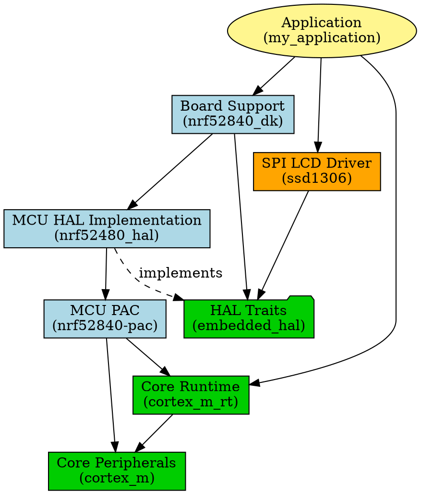

# Overview of Bare-Metal Rust

## A Layered Approach

When building bare-metal Systems in Rust, we use Rust crates to help us build a modular system.

The elements in our system are:

* The program you are writing
* The MCU are running on
* The PCB (or Board) your MCU is on
* The external devices connected to your MCU

## The Layers

To support these elements, we (usually) have these layers.

* Application
* Board Support
* External Drivers (e.g. SPI LCD Driver)
* Hardware Abstraction Layer Traits
* MCU Hardware Abstraction Layer Implementation
* MCU Peripheral Access Crate
* Core Peripherals
* Core Runtime

---

## Don't worry

There's a lot here. We're going to take it step by step, starting at the bottom.
