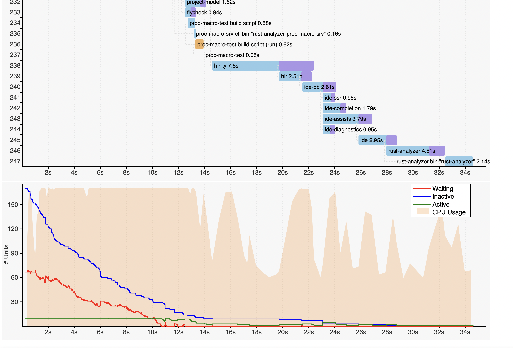

# Rust Projects Build Time

## Understanding Rust projects build time

* Cargo keeps track of changes you make and only rebuilds what is necessary
* when building a crate `rustc` can do most of work in parallel, but some steps still require synchronization
* depending on the type of build, times spent in different build phases may be vastly different.
    * debug vs release
    * various flags for `rustc` and LLVM
    * a build from scratch vs an incremental build

## Producing a build timings report

`rm -rf target/debug && cargo build --timings`

```text
.
└── target/
    ├── cargo-timings/
    │   ├── cargo-timings.html
    │   └── cargo-timings-<timestamp>.html
    ├── debug/
    └── ...
```

## Timings Report



## Reading the report

* Cargo can't start building a crate until all its dependencies have been built.
    * Cargo only waits for `rustc` to produce an LLVM IR, further compilation by LLVM can run in background (purple)
* a crate can't start building until its `build.rs` is built and finishes running (yellow)
* if multiple crates depend on a single crate they often can start building in parallel
* if a package is both a binary and a library then the binary is built after a library
    * integration tests, examples, benchmarks, and documentation tests all produce binaries and thus take extra time to build.

## Actions you can take

## Keep your crates independent of each other

* Bad dependency graph:
    ```text
    D -> C -> B -> A -> App
    ```
* Good dependency graph (A, B, and C can be built in parallel and with greater incrementality):
    ```text
      /-> A  \
    D ->  B  -> App
      \-> C  /
    ```
Note:
To clarify

* more parallelism -> the compiler can do more work at the same time
* more incrementality -> the compiler can avoid doing work it's done before

## Turn off unused features

* Before:
    ```toml
    [dependencies]
    tokio = { version = "1", features = ["full"] } # build all of Tokio                .
    ```
* After:
    ```toml
    [dependencies]
    tokio = { version = "1", features = ["net", "io-util", "rt-multi-thread"] }
    ```

## Prefer pure-Rust dependencies

* crate cannot be built before `build.rs` is compiled and executed
    * crates using C-dependencies have to rely on `build.rs`
    * `build.rs` might trigger C/C++ compilation which in turn is often slow

* e.g.: `rustls` instead of `openssl`

## Use multi-module integration tests:

* Before (3 binaries)
```text
├── src/
│   └── ...
└── tests/
    ├── account-management.rs
    ├── billing.rs
    └── reporting.rs
```
* After (a single binary)
```text
├── src/
│   └── ...
└── tests/
    └── my-app-tests/
        ├── main.rs   # includes the rest as modules       .
        ├── account-management.rs
        ├── billing.rs
        └── reporting.rs
```
* Also benchmark and examples

## Other tips

* split your large package into a few smaller ones to improve build parallelization
* extract your binaries into separate packages
* remove unused dependencies

## Tools

* `cargo-chef` to speed up your docker builds
* `sccache` for caching intermediary build artifacts across multiple projects and developers
