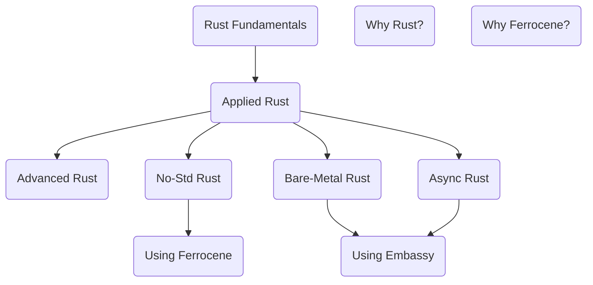

# Start Here

Make sure to have `rustup`, `VSCode` and the `rust-analyzer` VSCode extension installed.

Our various Rust training courses are planned to fit together as follows. Some of these courses are available now, and some are in development and will be available in the future.

* **Rust Fundamentals**: Covers the basics - types, writing functions, using iterators.
* **Applied Rust**: Using Rust with Windows, macOS or Linux.
* **Advanced Rust**: Deep-dives into specific topics.
* **Async Rust**: Futures, Polling, Tokio, and all that jazz.
* **Ferrocene**: Working with our qualified toolchain
* **No-Std Rust**: Rust without the Standard Library.
* **Bare-Metal Rust**: Rust on a micro-controller.
* **Using Embassy**: Async-Rust on a micro-controller.
* **Why Rust?**: A (stand-alone) half-day tour of Rust for decision-makers, technical leads and managers.
* **Why Ferrocene?**: A (stand-alone) 90 minute tour of Ferrocene.
