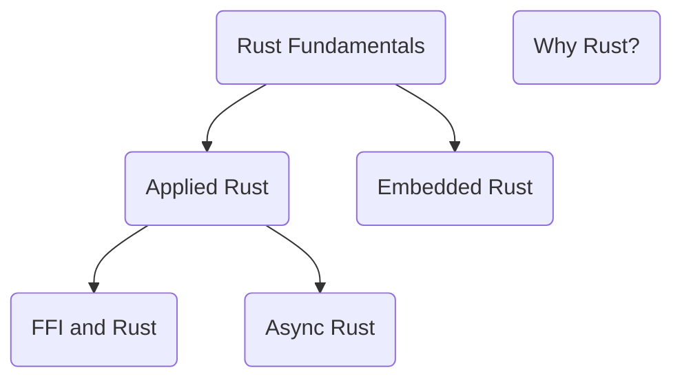

# Start Here

Make sure to have `rustup`, `VSCode` and the `rust-analyzer` VSCode extension installed.

Our various Rust training courses fit together as follows:

* **Rust Fundamentals**: Takes 3 half-days of training.
* **Applied Rust**: Once you understand the fundamentals, you can learn about coding as part of an organization in Rust. ~1.5 half-days.
* **Async Rust**: Futures, Polling, Tokio, and all that jazz. ~1.5 half days.
* **Embedded Rust**: Rust in your micro-controllers. ~3 half days.
* **FFI and Rust**: Bring Rust to your C, or C to your Rust. ~1.5 half days.
* **Why Rust?**: A (stand-alone) half-day tour of Rust for decision-makers, technical leads and managers.
